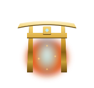

# Getting Started

{ .lgnd-emblem }

New here? Here's the path from zero to playing:

1. **[Install the Client](install.md)** — get a working FFXI client and launcher on your machine.
2. **[Connect to the Server](connect.md)** — point the client at the Relaunch server.
3. **[First Steps](first-steps.md)** — once you're in, this walks you through your first hour: leveling to 99, grabbing starter gear, and unlocking the custom systems.
4. **[Your First Session](your-session.md)** — setup done? This is the core gameplay loop and the rewards that keep you coming back.
5. **[Troubleshooting](troubleshoot.md)** — stuck on a connection, version, or login error? Start here.

If you've played retail FFXI before, the client setup is the same — only the server you point at changes.

---

<!-- DOCGEN:BEGIN id="last-updated" -->
<!-- content-hash: 3a7a3564d807 -->
_Last updated: 2026-07-13 22:00 PDT_
<!-- DOCGEN:END id="last-updated" -->
