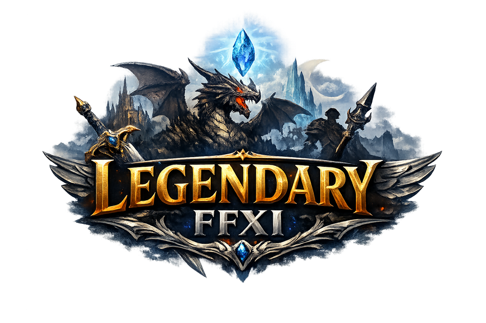

---
hide:
  - navigation
  - toc
---

  <h1 class="lgnd-hero__sr">FJB Relaunch — FFXI Private Server</h1>
  
  
Fresh Start Server

  

  
Extreme QoL. Fast progression. No grind tax.

**Hit 99 in an hour. Chase best-in-slot for months. This is FFXI the way it should feel.**

The Relaunch is a fresh-start FFXI private server built around one idea: the grind should be *fun*, not a wall. We cut the mandatory busywork, kept the depth, and bolted on a custom endgame that gives you something real to chase — whether you've been playing for a week or a year.

!!! tip "New Player? Start here."
    Don't know where to begin? The **[Getting Started guide](getting-started/index.md)** walks you through installing the client, connecting to the server, and taking your first steps — in about 20 minutes.

!!! note "Already playing? See what's new"
    The **[Changelog](changelog.md)** lists every recent update and balance change, newest first, grouped by week.

---

## What makes this server different

Retail FFXI is a masterpiece buried under 20 years of time-gating. Most private servers swing the other direction and trivialize everything. This server splits the difference:

- **Fast leveling, real endgame.** <!--setting:map.EXP_RATE-->3<!--/setting-->× mob EXP (plus <!--setting:main.EXP_RATE-->10<!--/setting-->× from books, FoV/GoV & Records of Eminence) gets you to 99 in a few hours, not months. Then the actual game begins.
- **Everything unlocked at creation.** Advanced jobs, all outpost warps, all maps, full inventory — no arbitrary gates.
- **Custom content built for long-term play.** The Hunting League, Reforge gear, Ascension, and weekly objectives give you a loop that doesn't expire.
- **A small, friendly community.** No drama, no gatekeeping — just people who like this game.

---

## Feature highlights

:crossed_swords: **Hunting League** — A custom 5-rank NM hunting system. Kill your way from Initiate to Legend, unlocking gear, titles, and HL Points at every tier.

:crown: **Ascension** — The endgame *above* the endgame. Reaching Legend opens a per-job, no-cap progression track: re-clear escalating superboss Courts to bank Ascension Points and spend them on permanent stat boosts. The gauntlet swaps to a deadlier roster every 10 ascensions, so the climb never goes stale.

:shield: **Reforge system** — Three parallel NM ladders (AF, Relic, Empy) that upgrade your armor from base all the way to +3. Best-in-slot is earnable, not bought.

:gem: **Augment Moogle** — 400+ augment options. Trade catalysts from NM kills to permanently customize your gear in ways retail never allowed.

:calendar: **Weekly Hunt Board** — Five rotating objectives every week. Complete all five for a big bonus. Always something to do.

:trophy: **Wave Master** — An NPC arena in Escha - Ru'Aun that spawns themed NM waves for solo or group practice. Earn Hunt Marks. Flex on your friends.

:dart: **Hunter's Guild** — Four hunting guilds that rank up as you kill their NMs, permanently boosting the marks every kill pays out. Hit Grandmaster across all of them for the Trinity and Apex Hunter titles.

:wolf: **Custom Trusts** — Allies you won't find on retail: **Gemma** (a full healer / buffer / debuffer in a deceptively small package) and **Meat** (an unkillable wall that never drops aggro).

:coin: **Living economy** — The auction house is never empty: a market-maker keeps thousands of gear listings stocked around the clock — a built-in price floor and gil sink — so you can actually *buy* your upgrades.

:medal: **Achievements & Leaderboards** — 26 milestones that pay bonus marks and titles as you rack up first kills, tier climbs, and lifetime records — plus live server leaderboards (top hunters, fastest clears, most augments) to climb.

:sparkles: **Adventuring Fellow** — A personal companion any job can summon. It levels from your kills, and you build it by spending stat points however you like.

:boom: **Voidwatch** — Examine Planar Rifts scattered across 30 overworld zones, fight tier-scaled Voidwalker NMs, and probe their hidden weaknesses to shape your rewards.

---

## Server rates

| Setting | Rate |
|---|---|
| EXP (mob kills) | <!--setting:map.EXP_RATE-->3<!--/setting-->× |
| EXP (scripted: books, FoV/GoV, RoE) | <!--setting:main.EXP_RATE-->10<!--/setting-->× |
| Capacity Points (scripted) | <!--setting:main.CAPACITY_RATE-->10<!--/setting-->× |
| Sparks | <!--setting:SPARKS_RATE-->10<!--/setting-->× |
| Gil from quests | <!--setting:GIL_RATE-->100<!--/setting-->× |
| Magic / WS power | <!--setting:main.WEAPON_SKILL_POWER:int-->2<!--/setting-->× |
| Mob drop rate | <!--setting:DROP_RATE_MULTIPLIER-->3<!--/setting-->× |
| Starting level cap | <!--setting:INITIAL_LEVEL_CAP-->99<!--/setting--> (no Limit Break needed) |
| Run speed | <!--setting:BASE_SPEED-->100<!--/setting--> base / <!--setting:SPEED_LIMIT-->500<!--/setting--> cap |
| Content | Through Seekers of Adoulin + Abyssea + all add-ons |

---

!!! note "These docs reflect the live Relaunch server"
    Many pages — server rates, player commands, spell lists, gear, Hunting League tiers, augment values — are **generated straight from the Relaunch server's own data** and refreshed regularly, so what you read here reflects what's actually running in-game. Spot something that's drifted out of date? Flag it on Discord and it'll be fixed.

---

## New character bonuses

Every new character starts with:

- :moneybag: **<!--setting:START_GIL:comma-->5,000,000<!--/setting--> Gil** in your wallet
- :school_satchel: **80 inventory slots** (the maximum)
- :world_map: **All maps** for every zone
- :round_pushpin: **All outpost warps** already unlocked
- :sparkles: **Advanced jobs unlocked** — no quest required
- :star: **Subjob unlocked** — use it at full level immediately

---

## What's waiting at endgame?

!!! info "The real game starts at 99."
    Most servers have nothing to do after you level cap. This server was built around that problem.

**Hunting League (5 tiers)**
Progress through Initiate → Hunter → Elite → Champion → Legend by killing increasingly difficult NMs. Each tier unlocks stronger gear options, higher HL Point rates, and exclusive titles. The grind is real — and it's meant to be.

**Ascension / Prestige (the layer above Legend)**
The true ceiling. Reaching Legend tier opens the **Ascension Altar** in Provenance — a per-job, *infinite* progression track. Defeat the **Nightmare Court** (three dread superbosses), pay an escalating Mark cost, and bank Ascension Points to permanently empower the job you're playing.

**Hunter's Guild (4 guilds, lifetime amplifiers)**
A passive reputation layer on top of every NM track. Each guild — AF, Relic, Empyrean, and League — ranks up as you kill its NMs, permanently amplifying the marks you earn from that source. Push to Grandmaster across multiple guilds for the **Trinity** and **Apex Hunter** capstones.

**Reforge Gear (+3 from NM kills)**
Three independent NM ladders — AF Marks from Sky Gods, Relic Marks from Unity NMs, Empy Marks from Abyssea NMs — each upgrades a full armor set from base to +1 to +2 to +3. No RNG. No gacha. Just kills.

**Augment Moogle (400+ augment options)**
Catalysts drop from monsters across the world. Trade them to the Augment Moogle to permanently apply stat bonuses to your gear. Pair with the Augment Sage to push augment strength even further.

**Voidwatch**
Examine Planar Rifts across 30 overworld zones to trigger tier-scaled Voidwalker NM fights. Probe hidden weaknesses with magic, weaponskills, and ranged attacks to light up Spectral Alignments and earn bigger rewards from the Riftworn Pyxis.

**Adventuring Fellow**
Summon a personal companion on any job. It levels from your kills and you spend the points on the stats you choose — name it, pick its look, and bring it into every fight.

**Weekly Hunt Board**
Five objectives, reset every week. Complete all five and you earn a significant bonus. Always rotating, never stale.

**Daily Board**
Three fresh objectives every day, reset at UTC midnight. Clear all three in one day for a bonus on top.

**Custom Trusts**
Summons you won't find on retail. **Gemma** heals, raises, buffs, debuffs, and magic-bursts your skillchains. **Meat** soaks every hit and refuses to let go of aggro. Each unlocks permanently through Hunting League rank + Hunt Marks (Gemma: Rank 3 + 3,000 marks; Meat: Rank 2 + 2,000; Corvus: Rank 4 + 5,000) — no gil required.

**Achievements (26 milestones)**
Twenty-six personal milestones paying bonus Hunt Marks and titles, with the biggest ones triggering a server-wide announcement.

**Leaderboards**
See where you rank across the server — most augments crafted, top hunters, fastest clears — pulled live from the database and refreshed regularly.

---

*Think this sounds good? [Get started now.](getting-started/index.md) Or read [What's Custom](changes/index.md) for the full breakdown — and check the [Changelog](changelog.md) for the latest updates.*
