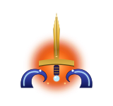

# Game Master — Wave Mode

{ .lgnd-emblem }

The **Wave Master** in Escha - Ru'Aun spawns themed enemy waves around you for solo or small-group survival. Pick a difficulty, brace, and try not to die. There are **four Wave Masters** spread across the zone — each is a full, independent instance of the system, so grab whichever one is free.

!!! tip "Summary"
    Type **`!wm1`**, **`!wm2`**, **`!wm3`** or **`!wm4`** to warp straight to any of the four Wave Masters in Escha - Ru'Aun (or **`!wavemaster`** for the first). Talk to the NPC, pick a difficulty, wait the grace period. NMs appear around you. Kill them, the next wave spawns, repeat. Clear all waves for a Hunt Marks bonus.

## How a session runs

1. Type **`!wm1`**, **`!wm2`**, **`!wm3`** or **`!wm4`** (or **`!wavemaster`** for the first) to warp to a Wave Master in Escha - Ru'Aun, then talk to the NPC and pick a difficulty.
2. Confirm Start. You get a short grace window (5-8 sec) to ready up.
3. Mobs spawn in a ring around your current position. They aggro on sight.
4. Each kill awards a small HL Points bump (your "wave points").
5. Wave cleared (all mobs dead) → next wave starts after the configured delay.
6. Complete every wave → big completion bonus added to HL Points.

## Difficulty tiers

The roster below reflects what's currently live on the server.

<!-- DOCGEN:BEGIN id="game-master-difficulty" -->
| Difficulty | Waves | Mobs/wave | Wave delay | Per-kill bonus | Completion bonus |
|---|---:|---:|---:|---:|---:|
| Easy | 3 | 1 | 20s | +20 marks | **+50 marks** |
| Normal | 5 | 1 | 25s | +20 marks | **+100 marks** |
| Hard | 5 | 2 | 25s | +20 marks | **+200 marks** |
| Insane | 5 | 3 | 15s | +20 marks | **+400 marks** |
| Nightmare | 7 | 4 | 10s | +20 marks | **+800 marks** |
<!-- DOCGEN:END id="game-master-difficulty" -->

## Mob roster per difficulty

Each wave picks a random mob from the difficulty's pool:

<!-- DOCGEN:BEGIN id="game-master-mob-roster" -->
| Difficulty | Mobs in the pool |
|---|---|
| Easy | Argus, Stray Mary, Dune Widow, Capricornus, Leaping Lizzy, Tom Tit Tat, Aquarius |
| Normal | Boggelmann, Hakutaku, Steam Cleaner, Faust, Serket, Simurgh, Roc |
| Hard | Cerberus, Hydra, Khimaira, Tiamat, Nidhogg, King Behemoth, Vrtra |
| Insane | Bahamut, Ouryu, Byakko, Suzaku, Kirin, Absolute Virtue, Shinryu |
| Nightmare | Kirin, Absolute Virtue, Pandemonium Warden, Shinryu |
<!-- DOCGEN:END id="game-master-mob-roster" -->

The pool can grow or shrink over time; the in-game options always reflect what's currently configured.

## Session rules

- **One session per character.** Talking to the NPC mid-session shows an "Abort current session" option that cleans up live mobs.
- **Zone change = abort.** Leaving the zone ends the session and despawns any still-alive mobs. You don't get the completion bonus.
- **Friends can help.** Killing blows by anyone count toward your wave clear, but only the actual killer earns the per-kill point bump.
- **NM Slayers counter.** Every kill (yours or a helper's) counts toward the [Top NM Slayers leaderboard](../community/leaderboards.md).

## Strategy notes

- Mobs are real NMs from the Hunting League pool. They hit hard. **Don't try Insane until you can solo Shinryu.**
- The spawn ring is `5-8 units` from your position. Pull-to-camp tactics work, but new waves will spawn around your *current* position — don't drift too far from your safety spot.
- Wave delay starts AFTER the wave is cleared, not after wave start. Take a breather, drink a potion, reposition.
- The bonus is paid out only on **full clear**. Dying mid-session forfeits it.

---

<!-- DOCGEN:BEGIN id="last-updated" -->
<!-- content-hash: 40ab96dbca42 -->
_Last updated: 2026-07-05 07:37 UTC_
<!-- DOCGEN:END id="last-updated" -->
